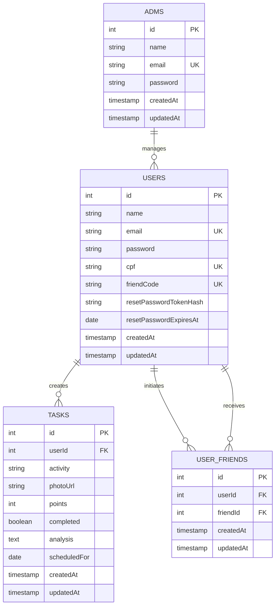

# Arquitetura do Banco de Dados - NeuroXP

## Diagrama Entidade-Relacionamento (DER)



## Descrição das Tabelas

### USERS (Usuários)
Armazena informações de contas de usuários da plataforma.

| Campo | Tipo | Constraints | Descrição |
|-------|------|-------------|-----------|
| id | INTEGER | PRIMARY KEY, AUTO_INCREMENT | Identificador único do usuário |
| name | VARCHAR(100) | NOT NULL | Nome completo do usuário |
| email | VARCHAR(100) | NOT NULL, UNIQUE | Email único para login |
| password | VARCHAR(100) | NOT NULL | Hash bcryptjs da senha |
| cpf | VARCHAR(11) | NOT NULL, UNIQUE | CPF sem formatação (11 dígitos) |
| friendCode | VARCHAR(5) | NOT NULL, UNIQUE | Código único para adicionar amigos |
| resetPasswordTokenHash | VARCHAR(64) | NULLABLE | Hash do token de reset de senha |
| resetPasswordExpiresAt | DATE | NULLABLE | Data de expiração do token |
| createdAt | TIMESTAMP | AUTO | Data de criação |
| updatedAt | TIMESTAMP | AUTO | Data da última atualização |

**Índices:**
- PRIMARY KEY (id)
- UNIQUE (email)
- UNIQUE (cpf)
- UNIQUE (friendCode)

---

### TASKS (Tarefas)
Armazena tarefas/atividades dos usuários com pontuação e status.

| Campo | Tipo | Constraints | Descrição |
|-------|------|-------------|-----------|
| id | INTEGER | PRIMARY KEY, AUTO_INCREMENT | Identificador único da tarefa |
| userId | INTEGER | NOT NULL, FK(users.id) | Referência ao usuário proprietário |
| activity | VARCHAR(255) | NOT NULL | Descrição da atividade |
| photoUrl | VARCHAR(500) | NULLABLE | URL da foto da atividade |
| points | INTEGER | DEFAULT 10 | Pontos XP ganhos ao completar |
| completed | BOOLEAN | DEFAULT FALSE | Status de conclusão |
| analysis | TEXT | NULLABLE | Análise de IA da foto |
| scheduledFor | DATE | NULLABLE | Data agendada da atividade |
| createdAt | TIMESTAMP | AUTO | Data de criação |
| updatedAt | TIMESTAMP | AUTO | Data da última atualização |

**Índices:**
- PRIMARY KEY (id)
- FOREIGN KEY (userId) → USERS(id) ON DELETE CASCADE
- INDEX (userId)
- INDEX (userId, completed)

---

### USER_FRIENDS (Amigos)
Tabela de junção que mantém relacionamentos de amizade entre usuários.

| Campo | Tipo | Constraints | Descrição |
|-------|------|-------------|-----------|
| id | INTEGER | PRIMARY KEY, AUTO_INCREMENT | Identificador único |
| userId | INTEGER | NOT NULL, FK(users.id) | ID do usuário que adicionou |
| friendId | INTEGER | NOT NULL, FK(users.id) | ID do amigo adicionado |
| createdAt | TIMESTAMP | AUTO | Data de criação |
| updatedAt | TIMESTAMP | AUTO | Data da última atualização |

**Constraints:**
- FOREIGN KEY (userId) → USERS(id) ON DELETE CASCADE
- FOREIGN KEY (friendId) → USERS(id) ON DELETE CASCADE
- UNIQUE (userId, friendId) - Evita duplicatas

---

### ADMS (Administradores)
Armazena contas de administradores da plataforma.

| Campo | Tipo | Constraints | Descrição |
|-------|------|-------------|-----------|
| id | INTEGER | PRIMARY KEY, AUTO_INCREMENT | Identificador único do admin |
| name | VARCHAR(100) | NOT NULL | Nome do administrador |
| email | VARCHAR(100) | NOT NULL, UNIQUE | Email único para login |
| password | VARCHAR(100) | NOT NULL | Hash bcryptjs da senha |
| createdAt | TIMESTAMP | AUTO | Data de criação |
| updatedAt | TIMESTAMP | AUTO | Data da última atualização |

**Índices:**
- PRIMARY KEY (id)
- UNIQUE (email)

---

## Relacionamentos

### 1. USERS ↔ TASKS (1:N)
- **Descrição:** Um usuário pode ter muitas tarefas
- **Tipo:** One-to-Many
- **Constraint:** CASCADE ON DELETE - Deletar um usuário remove todas suas tarefas
- **Chave Estrangeira:** TASKS.userId → USERS.id

### 2. USERS ↔ USER_FRIENDS (N:N)
- **Descrição:** Um usuário pode ter muitos amigos e ser amigo de muitos usuários
- **Tipo:** Many-to-Many (self-referencing)
- **Constraint:** CASCADE ON DELETE - Deletar um usuário remove todas suas amizades
- **Relacionamentos:**
  - USERS.id ← USER_FRIENDS.userId (quem adicionou)
  - USERS.id ← USER_FRIENDS.friendId (quem foi adicionado)

### 3. ADMS ↔ USERS (1:N)
- **Descrição:** Administradores gerenciam usuários (relação lógica)
- **Tipo:** One-to-Many (sem foreign key explícita)
- **Nota:** Não há restrição de banco de dados, apenas relacionamento lógico

---

## Configuração do Banco de Dados

**Padrão:** MySQL 5.7+
**Character Set:** UTF8MB4
**Collation:** utf8mb4_unicode_ci

**Variáveis de Ambiente:**
- `DB_HOST`: Hostname (padrão: localhost)
- `DB_PORT`: Porta (padrão: 3306)
- `DB_USER`: Usuário MySQL (padrão: root)
- `DB_PASS`: Senha (padrão: vazio)
- `DB_NAME`: Nome do banco (padrão: tcc_db)
- `DB_SYNC_MODE`: Modo de sincronização (force, alter, safe)

---

## Fluxos de Transação

### Criação de Usuário
```
1. Verificar email/CPF duplicado (SELECT)
2. Gerar friend code único (loop com transaction lock)
3. Hash da senha (bcryptjs)
4. TRANSACTION BEGIN
   - Inserir usuário
5. TRANSACTION COMMIT
```

### Adição de Amigo
```
1. Buscar usuário por ID
2. Buscar amigo por friend code
3. TRANSACTION BEGIN
   - Lock: SELECT user_friends (row level)
   - Verificar se já é amigo
   - Inserir relação
4. TRANSACTION COMMIT
```

### Conclusão de Tarefa
```
1. Buscar usuário por ID
2. TRANSACTION BEGIN
   - Lock: SELECT task (row level)
   - Atualizar completed=true
   - Save
3. TRANSACTION COMMIT
```

---

## Índices de Performance

| Tabela | Índice | Tipo | Objetivo |
|--------|--------|------|----------|
| USERS | (id) | PRIMARY | Lookup rápido |
| USERS | (email) | UNIQUE | Validação duplicata, Login |
| USERS | (cpf) | UNIQUE | Validação duplicata, Lookup |
| USERS | (friendCode) | UNIQUE | Lookup por código de amigo |
| TASKS | (userId) | FOREIGN | Query tarefas por usuário |
| TASKS | (userId, completed) | COMPOSITE | Query tarefas pendentes/completas |
| USER_FRIENDS | (userId, friendId) | UNIQUE | Validação duplicata |
| ADMS | (email) | UNIQUE | Validação duplicata, Login |

---

## Notas de Segurança e Performance

1. **Senhas:** Sempre armazenadas com hash bcryptjs, nunca em plain text
2. **Transações:** Usadas para operações críticas que poderiam ter race conditions
3. **Locks:** Row-level locks em operações sensitive (add friend, complete task)
4. **Índices Compostos:** Utilizados para queries frequentes que filtram múltiplas colunas
5. **Cascade Delete:** Mantém integridade referencial ao deletar usuários
6. **Tokens Reset:** Expiram após 15 minutos (configurável)
